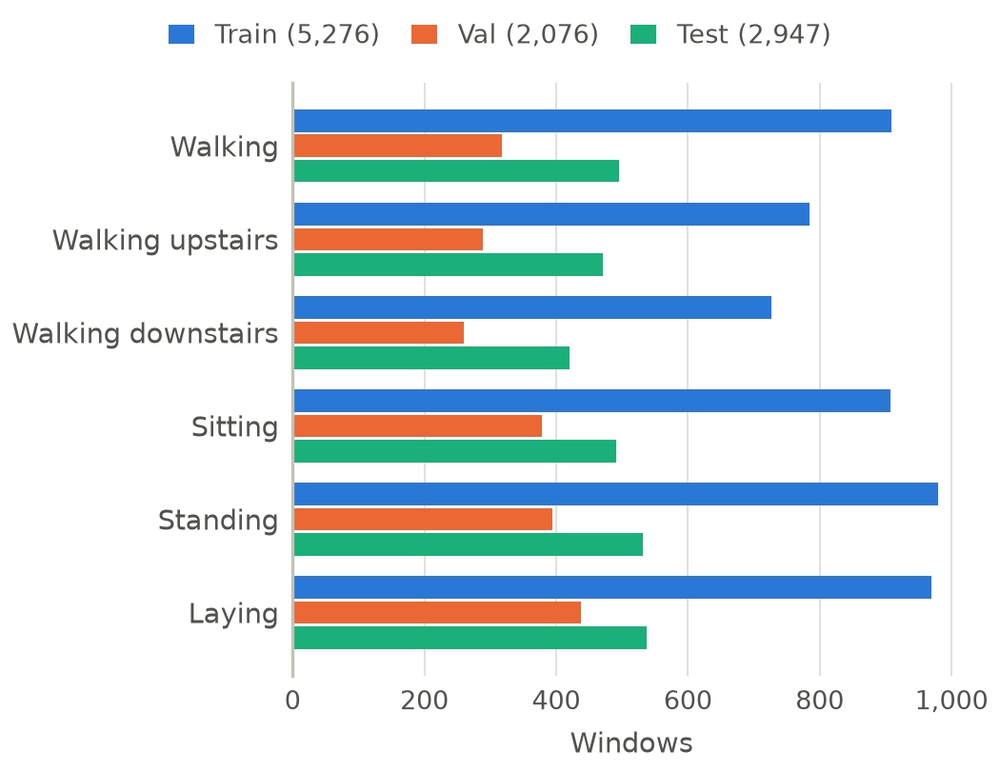
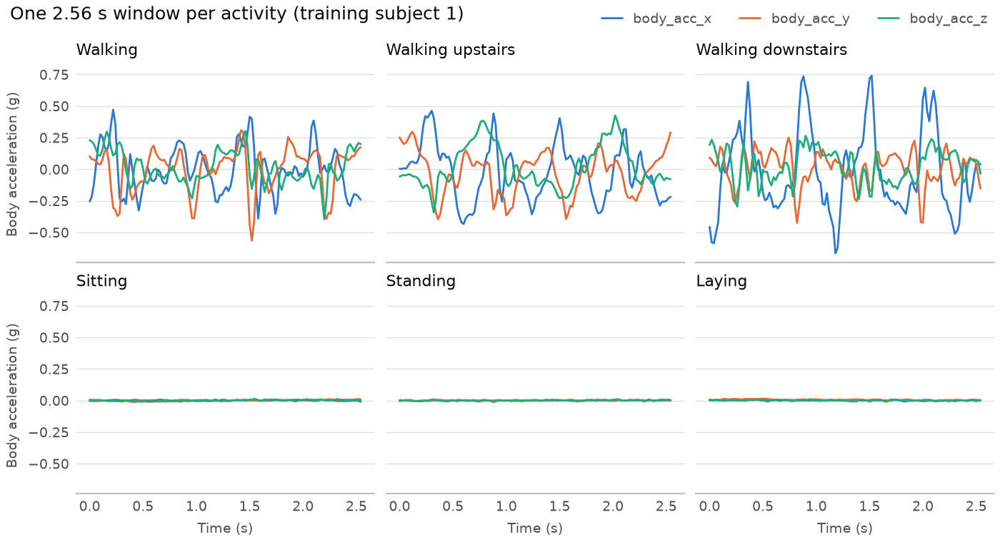

# UCI HAR dataset statistics

Generated by `python scripts/data_report.py` from `data/raw/UCI HAR Dataset` and `configs/split.json`. Do not edit by hand.

Each window is 128 samples (2.56 s at 50 Hz, 50% overlap) of 9 inertial channels; the dataset also provides 561 engineered features per window. Train and val are the official training subjects split by subject; test is the official test split.

## Windows per activity and split

Percentages are of the split's windows.

| Activity | Train | Val | Test | Total |
|---|---:|---:|---:|---:|
| WALKING | 909 (17.2%) | 317 (15.3%) | 496 (16.8%) | 1,722 |
| WALKING_UPSTAIRS | 784 (14.9%) | 289 (13.9%) | 471 (16.0%) | 1,544 |
| WALKING_DOWNSTAIRS | 726 (13.8%) | 260 (12.5%) | 420 (14.3%) | 1,406 |
| SITTING | 908 (17.2%) | 378 (18.2%) | 491 (16.7%) | 1,777 |
| STANDING | 980 (18.6%) | 394 (19.0%) | 532 (18.1%) | 1,906 |
| LAYING | 969 (18.4%) | 438 (21.1%) | 537 (18.2%) | 1,944 |
| **Total** | **5,276** | **2,076** | **2,947** | **10,299** |

## Subjects per split

| Split | Subjects | Count | Windows | Windows per subject (min to max) |
|---|---|---:|---:|---|
| Train | 1, 5, 6, 7, 8, 11, 14, 16, 17, 21, 23, 25, 26, 27, 30 | 15 | 5,276 | 281 to 409 |
| Val | 3, 15, 19, 22, 28, 29 | 6 | 2,076 | 321 to 382 |
| Test | 2, 4, 9, 10, 12, 13, 18, 20, 24 | 9 | 2,947 | 288 to 381 |

## Figures

*Windows per activity in the train, validation and test splits*

*Body acceleration of one window per activity (raw signal, training subject)*
